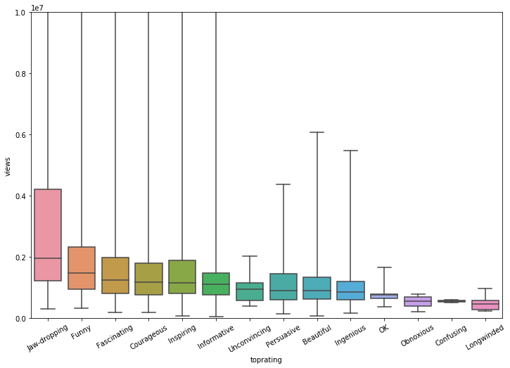
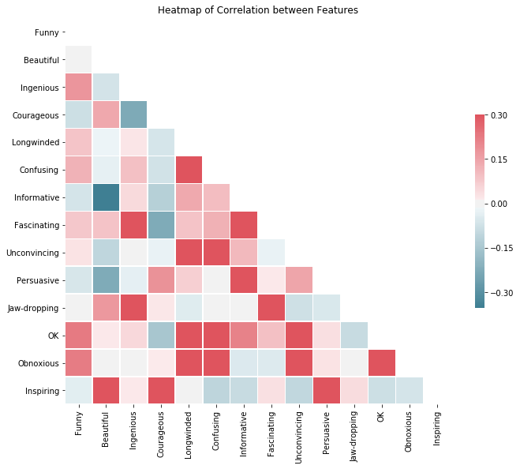
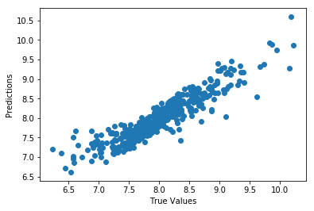

# What factors determine the most viral TED Talks?

## Goal
Answer the question above via multi linear regression analysis. Which ideas are truly worth sharing?:bulb:

## Data
- We used a dataset of 2550 unique entries from Kaggle, which contain information about talks. Features include types of ratings, Ted Talks (TED x, global, etc), duration and published date of the video.

- The most painstaking process was cleaning & preprocessing of data. Using numpy and pandas, we created columns of individual features according to its categorical & continuous state and converted it to a dataframe. First OLS regression did not return statistically significant results, so we scaled the data to create a more accurate relationship between target and features, resulting in __70% R-squared__ and __p-values under 1%__. So, feel free to observe our data without your colored glasses.

- Throughout the process we were able to perform explanatory analysis, create dope graphs and answer some critical questions. Here are some:

## What type of videos will get most views?

- Boxplot of top ratings (x) against views (y). Jaw-dropping, funny, and fascinating videos tend to have in general more views than others. Correlation between views and top rated category for each video.

## How do rating attributes correlate with one another?

- Heatmap of the correlation of all rating types. The more red a box is means that the two features are highly correlated, for example "Unconvincing" and "Longwinded". This data helped with visualization for feature selection.

## Train_Test_Split Result

- Regression result of trained data. Pretty good line.
